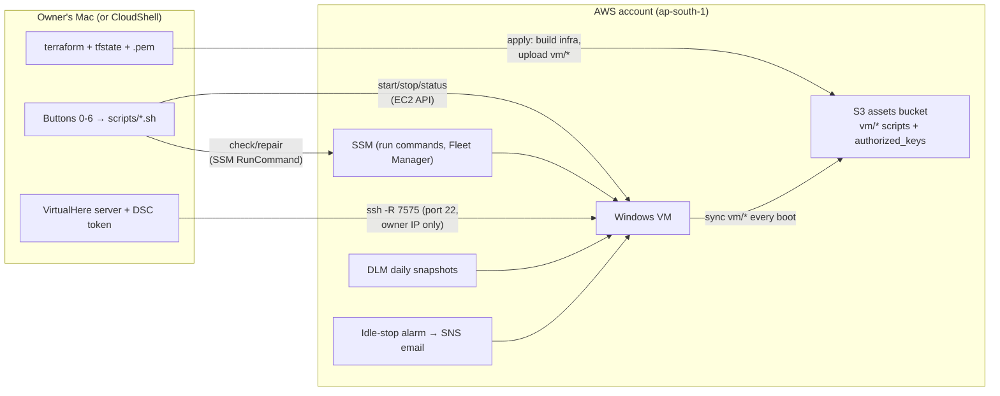
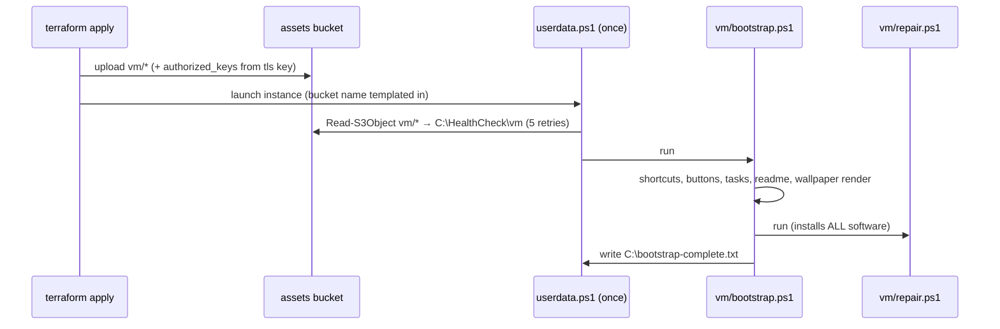

# Architecture

This document explains how the system fits together, why it's built this way,
and what you must not break. Read it before making non-trivial changes.
(Process and style live in [CONTRIBUTING.md](CONTRIBUTING.md); this is the
technical map.)

## The one-paragraph version

Terraform builds a stopped-by-default Windows Server 2022 EC2 instance plus its
safety net (snapshots, auto-stop, alerts, budget). All software/configuration
logic for the VM lives in [`vm/`](vm/) and is delivered through a private S3
"assets" bucket; the VM re-syncs and re-converges from it **at every boot**, so
the machine self-heals and is updatable without ever being rebuilt. Humans
interact through numbered double-click buttons (macOS) or AWS CloudShell —
never raw Terraform unless they want to.

## Actors and trust



Trust boundaries:

- The **security group** admits 3389/8443/22 from `allowed_cidr` (one /32)
  only. Egress is open (it's a workstation).
- The **instance role** can: use SSM, read the DCV license bucket, and read
  the assets bucket. Nothing else.
- The **`.pem` + `terraform.tfstate`** on the owner's machine are the crown
  jewels (Windows password decryption, SSH tunnel key, infra control). They
  are gitignored; the share-zip in `new` mode excludes them.

## Lifecycle flows

### First boot (fresh deployment)



`userdata.ps1` is a **thin loader** (< 2 KB) on purpose: EC2 user data is
capped at 16 KB and runs exactly once. Everything that might need to change
later must live in `vm/`, not in user data.

### Every boot after that

The `TallyCloudRepair` scheduled task runs `update-and-repair.ps1`:
re-sync `vm/*` from S3, then run `repair.ps1`. So a VM that missed an update
or suffered a failed download converges on next start — no human needed.

### Pushing a change to a live VM

1. Edit a file in `vm/`.
2. `terraform apply` — uploads changed objects (etag-diffed) to S3.
3. `./scripts/repair.sh` (immediate) **or** next boot (automatic).

`aws_instance` has `lifecycle.ignore_changes = [ami, user_data]` — editing
`userdata.ps1` does **not** reach existing VMs (and must never force
replacement; that would destroy data). If you change the loader, live VMs get
the equivalent behavior only through `vm/` scripts.

### Health & repair

- `vm/health-check.ps1` — read-only, behavior-based checks (e.g. Claude Code
  must *execute*, not merely exist — a file-presence check once masked a real
  breakage). PASS/WARN/FAIL lines + exit code.
- `vm/repair.ps1` — the **single source of truth for installed software**.
  Idempotent converge: check each component by its real artifact/behavior,
  install only if missing, retry once, `--ignore-checksums` fallback for
  choco (vendors re-release binaries under the same URL), multi-URL fallback
  for direct downloads. Reports `OK`/`FIXED`/`FAILED` per component.
- Remote invocation runs over SSM (`scripts/check.sh`, `scripts/repair.sh`),
  so they work even when the security group would block the caller.

### External download resilience

Vendors move files (observed twice in this project's first week). Defenses,
in order:

1. **Dynamic discovery** where possible — the TallyPrime URL is parsed from
   Tally's own site JS at repair time, newest release first, hardcoded
   known-good mirrors as fallback.
2. **Retries + fallback URLs + size validation** in `repair.ps1`'s `Get-File`.
3. **Weekly `linkcheck.yml`** runs `scripts/check-urls.sh` against every
   external URL the project uses; a dead link fails the workflow and emails
   maintainers before users hit it. **If you add an external URL anywhere,
   add it to `scripts/check-urls.sh`.**

### DSC token path (button 6)

The token never leaves the user's local machine. `scripts/share-dsc.sh`
starts the VirtualHere *server* app locally (auto-downloaded into gitignored
`local/`), then opens `ssh -R 7575:localhost:7575` to the VM using the
deployment's key pair. The VM runs Windows' built-in OpenSSH server
(installed/converged by `repair.ps1`; its authorized key is the tls key's
public half, delivered as `vm/authorized_keys` via the assets bucket). The
VM's VirtualHere client connects to `localhost:7575`. Free (no EasyFind
subscription), encrypted, no router configuration.

## Repo map

| Path | What it is |
|---|---|
| `*.tf` | Infra: `main.tf` (VPC, SG, IAM, S3 assets, instance), `backup.tf` (DLM), `autostop.tf` (idle alarm), `alerts.tf` (SNS + budget), `variables.tf`, `outputs.tf`, `versions.tf` |
| `userdata.ps1` | Thin first-boot loader (S3 sync → bootstrap). Changes don't reach live VMs |
| `vm/` | Everything the VM runs/serves — synced from S3 every boot: `bootstrap.ps1`, `repair.ps1`, `health-check.ps1`, `wallpaper.ps1`, `help.html`, `READ-ME-FIRST.txt` |
| `scripts/` | Owner-side operations (bash, macOS + Linux/CloudShell): setup-local, cloudshell-deploy, start/stop/status, get-password, check, repair, fix-ip, share-dsc, make-share-zip, check-urls |
| `[0-6] - *.command` | Double-click wrappers over `scripts/` for non-technical users |
| `USER-GUIDE.md` | End-user manual (plain language). `README.md` = deployer manual. This file = contributor manual |
| `.github/` | CI (`ci.yml`), weekly `linkcheck.yml`, release packaging (`release.yml`), Dependabot, templates |
| `docs/` | GitHub Pages site |
| `local/` | Gitignored: downloaded VirtualHere server app |

## Invariants — do not break these

1. **The instance is never replaced by a routine apply.** `ignore_changes`
   on `ami`/`user_data`, termination protection on, and nothing else in the
   instance block may become replacement-triggering. Data loss is the one
   unforgivable failure.
2. **Stopped ≈ free.** No feature may require the VM (or any new
   continuously-billed resource) to run 24×7. Idle cost stays ≈ disk +
  snapshots.
3. **Every script is idempotent** — buttons get double-clicked, boots repeat,
   repair re-runs. "Run twice = run once" everywhere, both sides.
4. **Checks test behavior, not presence.**
5. **Every failure path has a fallback the user can see**: DCV → RDP → Fleet
   Manager; auto-install → staged installer → download shortcut; FAIL lines
   name their fix.
6. **No secrets in git** — state, `.pem`, `terraform.tfvars`, `local/` are
   gitignored; share-zip `new` mode must stay secret-free.
7. **User-facing text stays jargon-free** (buttons, USER-GUIDE, wallpaper,
   help page, READ-ME). The target user is a non-technical accountant.

## Developing & testing

```bash
terraform fmt -recursive && terraform init -backend=false && terraform validate
shellcheck scripts/*.sh                  # warning-severity gates CI
# PowerShell lint (what CI does): PSScriptAnalyzer -Severity Error on
#   userdata.ps1 (wrapper tags stripped) and vm/*.ps1
bash scripts/check-urls.sh               # external URL liveness
```

End-to-end testing needs a real AWS account: deploy a copy with your own
`terraform.tfvars` (costs a few rupees/hour + ~$10/month if kept), then
`./scripts/check.sh` must reach ALL CHECKS PASSED and `./scripts/repair.sh`
must report all `OK`. `terraform destroy` your test copy when done — it's the
only destructive command in the project, treat it accordingly.

Known constraints you can't code around: TallyPrime has no silent installer
and license activation is interactive; GST emSigner / TRACES WebSigner are
downloadable only behind the user's own portal login; DSC token drivers depend
on the user's token brand. That's why first-login is "click Next a few times"
rather than zero-touch — keep it that small.
