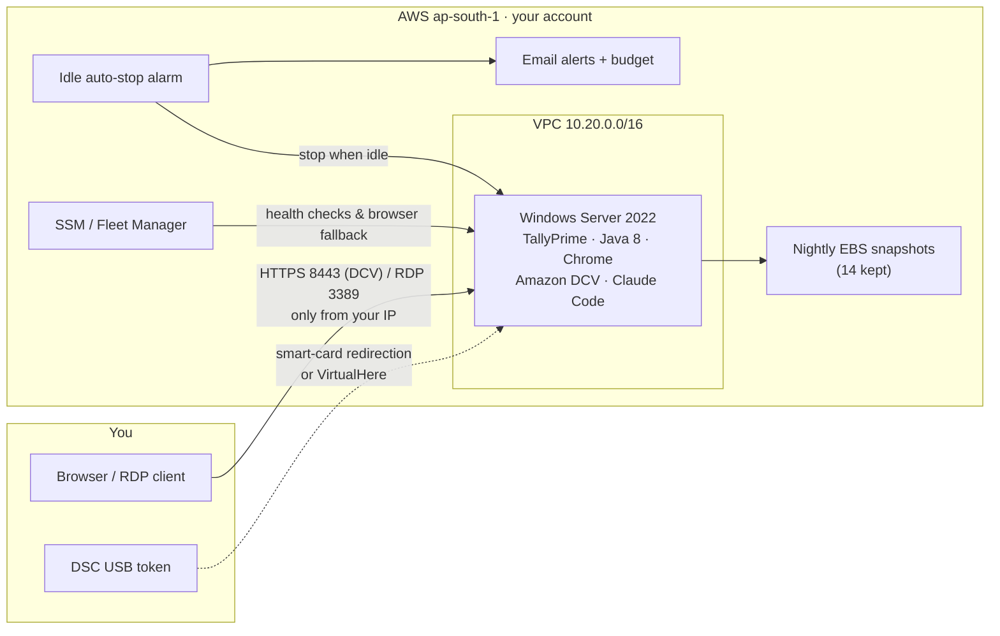

# Tally Cloud Workstation

[](https://github.com/abshingate/tally-cloud-workstation/actions/workflows/ci.yml)
[](LICENSE)
[](https://developer.hashicorp.com/terraform)
[](CONTRIBUTING.md)

A pay-only-when-you-use-it Windows machine on AWS for monthly accounting and
compliance work (TallyPrime, GST/PF/PT/Income-tax portals). The machine stays
**stopped** most of the month — you start it, work for a few hours, stop it —
and all data persists forever and is snapshotted daily.



**Typical cost: ~$10–12/month (~₹900–1,000)** for ~8–10 hours of monthly use
(mostly disk storage), versus $100+ for a machine running 24/7.

## What you get

| | |
|---|---|
| Machine | Windows Server 2022, t3.large (2 vCPU / 8 GB), 100 GB encrypted disk, Mumbai (`ap-south-1`) |
| Access | **Browser** via Amazon DCV (`https://<ip>:8443`), or RDP, or AWS Console → Fleet Manager |
| Pre-installed | Chrome, Adobe Reader, 7-Zip, Notepad++, **Java 8 (32-bit + 64-bit — required by GST emSigner / TRACES WebSigner)**, Amazon DCV, IST timezone, desktop shortcuts for GST / Income-tax / TRACES / EPFO / ESIC / MCA portals and DSC utilities |
| Data safety | Disk persists across stop/start · daily snapshots (14 kept) · termination protection on |
| Cost safety | Auto-stops after ~1 hour of idle CPU, so forgetting it never costs a full month |
| Alerting | Email on auto-stop events + AWS Budget emails at 80%/100% of monthly budget (set `alert_email`) |
| Claude | Git, Node.js LTS and the Claude Code CLI pre-installed — run `claude` on the VM |
| Health checks | `./scripts/check.sh` locally + "Check System Health" on the VM desktop |
| Self-healing | Every install re-verified at each boot; "Repair This Computer" button + `./scripts/repair.sh` reinstall anything broken; Tally's download URL is discovered live from their site |
| On-VM help | "Help and User Guide" desktop page (works offline) + an info wallpaper showing locations, versions, and what to do when something breaks |

## Three audiences, three documents

- **This README** is for the (technical) person who deploys and maintains the setup.
- **[ARCHITECTURE.md](ARCHITECTURE.md)** is for contributors — how the system
  works internally, lifecycle flows, and the invariants changes must respect.
- **[USER-GUIDE.md](USER-GUIDE.md)** is for the person who *uses* the machine —
  written in plain language, no jargon. Give them that file and the numbered
  `*.command` buttons in this folder (`1 - Turn ON Tally Computer`, `2 - Get
  Password`, `3 - Check Everything OK`, `4 - Fix Connection Problem`, `5 - Turn
  OFF Tally Computer`) — each is a double-click, no terminal needed. On the VM
  itself, `READ-ME-FIRST.txt` on the desktop covers first-time setup the same way.

## Prerequisites

- An AWS account (see below if you've never had one)
- A TallyPrime license (Silver single-user is enough; activated once, on the machine)
- On a Mac, button `0` installs the tooling ([AWS CLI](https://docs.aws.amazon.com/cli/latest/userguide/getting-started-install.html), [Terraform](https://developer.hashicorp.com/terraform/install) ≥ 1.5) automatically; install them yourself on other platforms

**Never had an AWS account?** This is the one genuinely manual part (Amazon
requires it): sign up at [aws.amazon.com](https://aws.amazon.com) with an
email, a credit/debit card, and phone OTP verification (~10 minutes). Then
create the access keys button `0` will ask for: AWS Console → IAM → Users →
Create user → attach `AdministratorAccess` → Security credentials → Create
access key. Everything after that is automated.

## Deploy (one time)

```bash
cp terraform.tfvars.example terraform.tfvars
# Edit terraform.tfvars: set allowed_cidr to "<your-ip>/32"
#   (find your IP with: curl -s https://checkip.amazonaws.com)

terraform init
terraform apply
```

Then wait ~10 minutes on first boot while software installs, and:

```bash
./scripts/get-password.sh   # Windows Administrator password (save it in a password manager)
./scripts/start.sh          # prints the browser + RDP address (already running after apply)
```

**First login (one time, ~5 min, no technical skill needed):** open
`https://<ip>:8443` in your browser (accept the self-signed-certificate
warning) and log in as `Administrator`. The TallyPrime install wizard **opens
by itself** — click Install, set the data folder to `C:\TallyData`, then enter
your Tally serial to activate the license. That's it; `READ-ME-FIRST.txt` on
the desktop walks through it.

Two things genuinely cannot be pre-installed by *any* automation, so they are
one double-click on first use instead (shortcuts are on the desktop):

- **Portal signer utilities** (GST emSigner, TRACES WebSigner): the portals
  only let *you* download them after logging in to *your* account. Their
  prerequisite — 32-bit Java 8 — is already installed, so it's download → Next
  → Finish.
- **Your DSC token's driver** (ePass2003 / ProxKey / mToken): depends on which
  brand of token you own — run the matching link in the desktop "DSC Setup"
  folder once.

## Everyday use

```bash
./scripts/start.sh     # ~2 min to boot, prints the current IP
# ... work in the browser (https://<ip>:8443) or via RDP ...
./scripts/stop.sh      # billing drops to storage-only
./scripts/status.sh    # is it running? what's the IP?
./scripts/check.sh     # full readiness check — AWS side + on-VM health via SSM,
                       # every problem highlighted with how to fix it
```

On the machine itself, the desktop has **"Check System Health"** (same checks,
for the non-technical user) and **"Claude Code"** — Claude runs on the VM too
(Git + Node.js + Claude Code CLI are pre-installed; sign in to your Anthropic
account on first run).

The public IP changes on every start — `start.sh` always prints the current one.
Prefer a desktop client? Use **Microsoft Remote Desktop** (free on the Mac App
Store) with the IP from `start.sh`.

## Self-healing and updates (how it stays foolproof)

External downloads move and fail — the design assumes it:

- All VM logic and content lives in [`vm/`](vm/) and is uploaded by Terraform
  to a **private S3 assets bucket in your account**. The VM re-syncs from it at
  **every boot**, then runs `repair.ps1` — an idempotent installer that checks
  each component by its real behavior (not just file presence) and reinstalls
  only what's missing, with retries and fallbacks.
- **Updating the fleet is just:** edit a file in `vm/` → `terraform apply`
  (uploads the change) → `./scripts/repair.sh` (or the next boot) applies it.
- The **TallyPrime installer URL is discovered live** from Tally's own site
  JavaScript (newest release wins), with last-known-good mirrors as fallback —
  a new Tally release can't break provisioning.
- A **weekly CI job** (`linkcheck.yml`) probes every external URL the project
  depends on and fails loudly when a vendor moves something — so the repo gets
  fixed before a user ever sees a dead link. Run it locally any time:
  `bash scripts/check-urls.sh`.
- On the VM, the non-technical path is two desktop buttons: **Check System
  Health** (PASS/FAIL for everything) → **Repair This Computer** (fixes it).

## Using your DSC (USB token) on the remote machine

Yes, a DSC works with a cloud machine — the token stays plugged into **your
local computer** and is *redirected* into the remote session. Three ways, pick
by what you connect from:

1. **From a Windows PC (most reliable):** connect with Remote Desktop, enable
   *Local Resources → Smart cards* in the connection settings, and the token
   appears on the remote machine automatically. This is standard practice for
   accountants using cloud VMs.
2. **From a Mac / via the browser:** smart-card redirection is unreliable on
   the Mac client and impossible in a browser tab, so the token travels over
   [VirtualHere](https://www.virtualhere.com/) USB-over-IP (server free for one
   device) through an **SSH reverse tunnel** — button `6 - Share DSC Token`
   automates it: VirtualHere server starts on the Mac, an SSH `-R` tunnel to
   the VM's built-in OpenSSH server (installed by `repair.ps1`, port 22 open
   only to your IP) carries port 7575, and the VM's VirtualHere client
   connects to `localhost:7575`. Free — no EasyFind subscription needed.
3. **Skip the DSC where the law allows:** GST and Income-tax accept
   Aadhaar-OTP e-verification (EVC) for proprietors and partnerships. A DSC is
   mainly mandatory for companies/LLPs (MCA filings) and some EPFO employer
   actions.

Practical routine: do everyday work in the browser; for the few minutes of
DSC-signing, connect via RDP from a Windows machine (or keep VirtualHere set
up). The token's driver must also be installed on the remote machine — one
click in the desktop "DSC Setup" folder, first time only.

## Good to know

- **If you can't connect**, your home IP probably changed: update `allowed_cidr`
  in `terraform.tfvars`, run `terraform apply`. (Or use AWS Console → Systems
  Manager → **Fleet Manager** → your instance → *Connect with Remote Desktop* —
  it works from anywhere, with no open ports.)
- **Restoring data**: every day at 2 AM IST a snapshot is taken (last 14 kept).
  To roll back, create a volume from a snapshot in the EC2 console and swap it in.
- **Never** run `terraform destroy` casually — it is the one command that deletes
  the machine and its disk. Termination protection also blocks accidental
  console/API terminations; snapshots survive even a destroy.
- **Tally license** activates once and survives stop/start (same machine every time).
- Windows Server license cost is included in the EC2 hourly rate — nothing to buy.

## Sharing this setup

This repo is generic — anyone can use it in their own AWS account. The
zero-knowledge path on a Mac: get them the folder, have them double-click
**`0 - First Time Setup (run once)`** — it installs Homebrew/AWS CLI/Terraform,
walks them through entering AWS keys, and deploys with confirmation. The
manual path:

```bash
git clone <this-repo> && cd <repo>
cp terraform.tfvars.example terraform.tfvars   # set their own allowed_cidr
terraform init && terraform apply
```

**No git, no Mac, no local tools at all?** Two helpers:

- `./scripts/make-share-zip.sh` builds `TallyCloud-new.zip` on your Desktop —
  a clean, secret-free package you can email/WhatsApp to anyone. (With the
  `operator` argument it instead packages *your* deployment — state and key
  included — for a trusted person to operate the same machine.)
- The recipient can deploy **entirely in the browser** via AWS CloudShell:
  upload the zip there and run `bash scripts/cloudshell-deploy.sh`. No local
  installs of any kind; the USER-GUIDE has the click-by-click steps. All the
  `scripts/*.sh` helpers are Linux-compatible and work inside CloudShell too.

To *operate* an existing deployment from a second computer, copy the whole
folder (including `terraform.tfstate` and the `.pem` file) to it and run
button `0` there — it installs tools and links up without deploying anything.
Keep deploys (`terraform apply`, button `4`) on one "owner" machine to avoid
state conflicts; other devices can always start/stop via the AWS Console app.

State files, the `.pem` key, and `terraform.tfvars` are gitignored, so the repo
never contains anything account-specific or secret.

## Costs (Mumbai, approximate)

| Item | Cost |
|---|---|
| t3.large Windows, running | ~$0.14/hour → ~$1.50 for 10 h/month |
| 100 GB gp3 disk (always) | ~$9/month |
| Daily snapshots | < $1/month |
| **Total** | **~$10–12/month** |

## Contributing

Contributions are welcome — see [CONTRIBUTING.md](CONTRIBUTING.md). Please
read the design principles there first; the north star is that a
**non-technical accountant** must be able to use the result. Security issues:
see [SECURITY.md](SECURITY.md).

## License

Copyright 2026 Tally Cloud Workstation contributors.
Licensed under the [Apache License 2.0](LICENSE).

TallyPrime is a product of Tally Solutions Pvt. Ltd.; this project is not
affiliated with or endorsed by Tally Solutions, AWS, or any government portal
it references. You need your own TallyPrime license and AWS account.
